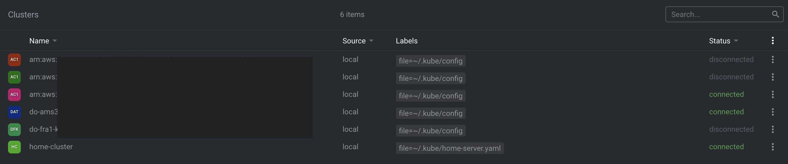

# Pihole su RaspberryPi cluster K3S (1 master - 1 agent) 

 
## Installazione [K3S](https://k3s.io/)

### Nodo server
	
Per eseguire i seguenti step, è necessario diventare l'utente *root*
	
```
sudo su -
```
	
- installazione di K3S 
	
```
curl -sfL https://get.k3s.io | K3S_KUBECONFIG_MODE="644" K3S_NODE_NAME="rasp2ModB" sh -s - --disable=traefik
```
> il parametro --disable=traefik serve per non abilitare il deploy automatico di [Traefik](https://traefik.io/) incluso in k3s. Questo è utile se si ha la necessità di modificare la configurazione di default di traefik come, ad esmepio, utilizzare una porta diversa dalla 80. Procederemo poi ad installarlo manualmente più avanti. 

- al termine dell'installazione, andiamo a recuperare il node-token
	
```
sudo cat /var/lib/rancher/k3s/server/node-token
```
il token servirà nella configurazione dell'agent.

### Nodo Agent

```
sudo su -
```
- installazione di K3s sul nodo agent

```
curl -sfL https://get.k3s.io | K3S_TOKEN="TOKEN" K3S_URL="https://ipNodoMaster:6443" K3S_NODE_NAME="servername" sh -
```
dove 

- **K3S_TOKEN** è il token recuperato precedentemente
- ***ipNodoMaster*** è l'indirizzo ip del nodo server configurato in precedenza
- **K3S\_NODE_NAME** è il nome che si vuole assegnare all'agent

> esempio 
> 
> ```
> curl -sfL https://get.k3s.io | 
> K3S_TOKEN="abcdef1abcdef1abcdef1abcdef1abcdef1abcdef1abcdef1abcdef1abcdef1abcd::server:fedcba9fedcba9fedcba9fedcba9fedc" 
> K3S_URL="https://192.168.0.1:6443" K3S_NODE_NAME="rasp3ModB" sh -
> ```

<br>
<br>

## Accesso al cluster da un altro pc tramite kubectl
Per accedere al cluster da un pc è necessario innanzi tutto installare kubectl come specificato nella documentazione ufficiale:

* [install kubectl on Linux](https://kubernetes.io/docs/tasks/tools/install-kubectl-linux)
* [install kubectl on macOS](https://kubernetes.io/docs/tasks/tools/install-kubectl-macos) 
* [install kubectl on Windows](https://kubernetes.io/docs/tasks/tools/install-kubectl-windows)

La configurazione di k3s è salvata nel file *k3s.yaml* all'interno del nodo server, nello specifico al path

```
/etc/rancher/k3s/k3s.yaml
```

> gli step di seguito si riferiscono a macOS, ipotizzando di configurare il cluster con il nome **home-server**

una volta installato kubectl sul pc dal quale si vuole accedere al cluster, accedere alla directory *.kube* nella home

```
cd ~/.kube

```
copiare dal nodo server il file di configurazione *k3s.yaml* (in questo caso rinominandolo in home-server.yaml ma non è necessario)

```
scp pi@raspberrypi.fritz.box:/etc/rancher/k3s/k3s.yaml ./home-server.yaml
```
modificare nel file appena scaricato (home-server.yaml) le seguenti voci:

```
apiVersion: v1
clusters:
- cluster:
    certificate-authority-data: ---non modificare---
    server: https://ipNodoMaster:6443 <-- modificare con l'ip del nodo master
  name: default
contexts:
- context:
    cluster: default
    user: default
  name: default
current-context: default
kind: Config
preferences: {}
users:
- name: default
  user:
    client-certificate-data: ---non modificare---
    client-key-data: ---non modificare---

```

Verificare la configurazione con
 
```
kubectl get nodes --kubeconfig=$HOME/.kube/home-server.yaml
```
Se l'output del comando sarà di questo tipo, la configurazione è corretta:

```
❯ kubectl get nodes --kubeconfig=$HOME/.kube/home-server.yaml
NAME         STATUS     ROLES                  AGE   VERSION
rasp2modb    Ready      control-plane,master   10h   v1.21.3+k3s1
rasp3modb    Ready      <none>                 10h   v1.21.3+k3s1
```

In questo modo è già possibile utilizzare tutte le funzionalità di *kubectl*, ma sarà sempre necessario specificare il file di configurazione da utilizzare (con *--kubeconfig=$HOME/.kube/home-server.yaml* )

### Utilizzo della variabile d'ambiente KUBECONFIG

In alternativa all'utilizzo del parametro *--kubeconfig=$HOME/.kube/home-server.yaml* , è possibile procedere in due modi:

1.  se questo è l'unico cluster che verrà utilizzato, è sufficiente rinominare il file di configurazione scaricato *home-server.yaml* in *config*

	```
	mv ~/.kube/home-server.yaml ~/.kube/config
	```

2. se invece si hanno già più configurazioni, è possibile sfruttare la variabile d'ambiente *KUBECONFIG* . All'avvio, kubectl controlla prima l'esistenza e il contenuto di questa variabile e, se *KUBECONFIG* non è valorizzata, allora va a cercare nella directory *~/.kube/* il file *config*. Agendo sulla variabile *KUBECONFIG* è anche possibile specificare più file di configurazione.
Nel nostro caso, avremo quindi un file *~/.kube/config* e un file *~/.kube/home-server.yaml*. Per utilizzare entrambi (kubectl farà automaticamente il merge delle due configurazioni) andremo a settare la variabile KUBECONFIG come segue:

	```
	export KUBECONFIG=$KUBECONFIG":`~/.kube/home-server.yaml:~/.kube/config"
	```
ovvero *KUBECONFIG* = valore attuale di *KUBECONFIG* concatenato(:) *home-server.yaml* concatenato(:) ~/.kube/config .
> N.B.: il valore di *KUBECONFIG* si perderà alla chiusura del terminale. Per renderlo persistente, è possibile sfruttare il file ~/.bashrc .

Una ulteriore opzione può essere quella di utilizzare un software di gestione e monitoraggio di cluster kubernetes come [Lens](https://k8slens.dev/) 
Con Lens è possibile copiare direttamente dal menù del tool (File -> add Cluster) il contenuto del file home-server.yaml modificato in precedenza

<p align="center"></p>

<p align="center"></p>
